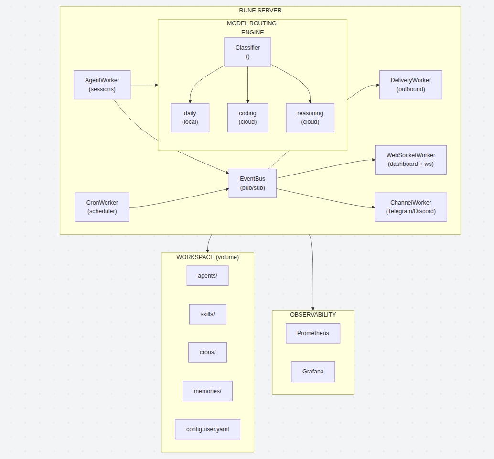

<div align="center">

```
██████╗ ██╗   ██╗███╗   ██╗███████╗
██╔══██╗██║   ██║████╗  ██║██╔════╝
██████╔╝██║   ██║██╔██╗ ██║█████╗
██╔══██╗██║   ██║██║╚██╗██║██╔══╝
██║  ██║╚██████╔╝██║ ╚████║███████╗
╚═╝  ╚═╝ ╚═════╝ ╚═╝  ╚═══╝╚══════╝
```

**An AgentOS for minimal devices.**

_Local-first autonomous AI runtime with multi-model routing, multi-agent dispatch,_
_persistent memory, scheduled tasks, and multi-channel delivery_

[](https://python.org)
[](https://docs.litellm.ai)
[](https://ai.google.dev/gemma)
[](https://fastapi.tiangolo.com)
[](https://docker.com)
[](LICENSE)

</div>

---

## What is Rune?

Rune is an **autonomous AI agent runtime** — an AgentOS designed for minimal hardware.
It runs a local Gemma 4 model for everyday queries (zero cloud cost) and intelligently
escalates to cloud providers (Fireworks AI, OpenAI, Anthropic, etc.) only when tasks
require advanced reasoning, coding, or live data.

Rune is **not just a chatbot**. It's a persistent, always-on system with:
- A **multi-agent architecture** where specialized agents collaborate
- A **smart model router** that classifies requests and picks the right model tier
- An **event-driven core** with crash-recoverable message delivery
- **Persistent memory** across conversations and sessions
- **Scheduled tasks** that run autonomously in the background
- **Multi-channel delivery** — CLI, WebSocket, Telegram, Discord

---

## Architecture

<div align="center">



</div>

---

## Features

### Multi-Model Routing

Rune doesn't use one model for everything. A **lightweight local classifier** (Gemma 4 running locally) categorizes every incoming request, then routes it to the optimal model tier:

| Category | Tier | Model | Cost |
|----------|------|-------|------|
| `daily` | Local | Gemma 4 | **Free** |
| `coding` | Cloud | Kimi K2 (Fireworks) | Per-token |
| `reasoning` | Cloud | DeepSeek V4 (Fireworks) | Per-token |

The classifier prompt understands nuance — _"hello world"_ is a greeting (daily), not a coding request. Requests needing live data, tool invocations, or multi-step logic are automatically escalated to `reasoning`.

If the chosen tier fails, Rune **automatically escalates** to the next tier (configurable per role via `escalate_to`).

### Multi-Agent Dispatch

Agents are defined as **Markdown files** (`AGENT.md`) with YAML frontmatter. Each agent has its own personality (`SOUL.md`), LLM overrides, and concurrency limits.

**Built-in agents:**

| Agent | Role |
|-------|------|
| `rune` | Default assistant — general conversations, coding, creative work. Has access to all tools and skills. |
| `ledger` | Memory manager — stores, organizes, and retrieves persistent memories on Rune's behalf. |

Agents can **dispatch tasks to each other** using the `subagent_dispatch` tool. Rune delegates memory operations to Ledger, which autonomously organizes facts into topics, projects, and daily notes.

```
User ──► Rune ──► "Remember I prefer TypeScript"
                       │
                       ▼  subagent_dispatch
                    Ledger ──► writes to memories/topics/preferences.md
                       │
                       ▼  DispatchResultEvent
                    Rune ──► "Got it, I'll remember that."
```

### Tools

Every agent has access to built-in tools and can be granted access to skills:

| Tool | Description |
|------|-------------|
| `read` | Read file contents |
| `write` | Write content to a file |
| `edit` | Find-and-replace within a file |
| `bash` | Execute shell commands |
| `websearch` | Search the web (via Firecrawl) |
| `webread` | Read and extract webpage content (via Crawl4AI) |
| `post_message` | Send messages to users (used by cron jobs) |
| `subagent_dispatch` | Delegate tasks to other agents |

### Skills

Skills are **modular, self-contained packages** that extend agent capabilities. They follow a progressive disclosure pattern:

1. **Metadata** (name + description) — always in context (~100 words)
2. **SKILL.md body** — loaded only when the skill triggers
3. **Bundled resources** (scripts, references, assets) — loaded on demand

**Built-in skills:**

| Skill | Description |
|-------|-------------|
| `cron-ops` | Create, list, and delete scheduled cron jobs |
| `skill-creator` | Meta-skill for designing and packaging new skills |

Create your own skills by dropping a `SKILL.md` in the `skills/` directory:

```
skills/
└── my-skill/
    ├── SKILL.md          # Instructions (YAML frontmatter + Markdown body)
    ├── scripts/          # Executable code
    ├── references/       # Documentation loaded on demand
    └── assets/           # Templates, images, etc.
```

### Cron Jobs

Schedule autonomous background tasks using standard cron syntax. Cron jobs are defined as `CRON.md` files:

```markdown
---
name: Daily Summary
description: Sends a daily activity summary
agent: rune
schedule: "0 9 * * *"
---

Check recent activity and use post_message to send me a summary.
```

Supports **one-off jobs** (`one_off: true`) for reminders and delayed tasks that auto-delete after execution. Minimum granularity is 5 minutes.

### Persistent Memory

Rune maintains long-term memory across sessions, organized into three axes:

```
memories/
├── topics/         # Timeless facts (preferences, identity, relationships)
├── projects/       # Project-specific context, decisions, progress
└── daily-notes/    # Day-specific events (YYYY-MM-DD.md)
```

The `ledger` agent manages memory autonomously — storing preferences in `topics/`, project context in `projects/`, and temporal events in `daily-notes/`. It consolidates, deduplicates, and migrates facts between axes.

### Context Window Management

When conversations grow large, Rune's **ContextGuard** proactively manages the context window:

1. **Truncate oversized tool results** (>10K chars)
2. If still over threshold, **compact history** — summarize older messages using the LLM, roll to a new session, and continue seamlessly

The compaction prompt preserves user requests, preferences, errors, corrections, and pending tasks.

### Multi-Channel Delivery

| Channel | Description |
|---------|-------------|
| **CLI** | Interactive chat via `rune chat` (connects to server over WebSocket) |
| **WebSocket** | Real-time bidirectional API at `/ws` |
| **Web Dashboard** | Built-in ops dashboard with chat UI at `/` |
| **Telegram** | Bot integration with user allowlisting |
| **Discord** | Bot integration with channel and user filtering |

All channels share the same event bus — a message from Telegram and a message from the web dashboard both flow through the same agent pipeline.

### Observability

Built-in Prometheus metrics track every LLM call:

| Metric | Description |
|--------|-------------|
| `rune_llm_calls_total` | Calls by role, tier, model, provider, outcome |
| `rune_llm_prompt_tokens_total` | Prompt tokens consumed |
| `rune_llm_completion_tokens_total` | Completion tokens consumed |
| `rune_fireworks_tokens_total` | Tokens billed through Fireworks |
| `rune_local_tokens_saved_total` | Tokens served locally (cost savings) |

The ops dashboard (`/`) shows:
- **Live worker status** — which workers are running, crashed, or idle
- **Agent registry** — all discovered agents and their models
- **Skill inventory** — loaded skills and descriptions
- **Cron schedule** — next run times and countdowns
- **Memory stats** — file counts per axis
- **System health** — CPU, memory, API latency
- **Token savings meter** — percentage of tokens served locally vs. cloud
- **Log tail** — last 60 log lines, parsed and structured
- **Model routing nodes** — live tier configuration and routing policies

Pre-configured Grafana dashboards are included for production monitoring.

### Event-Driven Core

Rune's internals are built on an **async event bus** with crash recovery:

- **InboundEvent** — external messages entering the system (platforms, cron)
- **OutboundEvent** — agent responses for delivery to platforms
- **DispatchEvent** — agent-to-agent task delegation
- **DispatchResultEvent** — results from dispatched tasks

Outbound events are **persisted to disk** (atomic write with fsync) before delivery. On crash recovery, pending events are replayed automatically — no messages are ever lost.

### Config Hot Reload

Edit `config.user.yaml` while the server is running — changes are picked up automatically via filesystem watchers. No restart required for:
- Model tier changes
- API key rotation
- Channel configuration
- Routing bindings

API keys and model tiers can also be updated via the **Settings API** (`/api/settings`).

---

## Quick Start

### Docker (Recommended)

```bash
# Clone the repo
git clone https://github.com/samueljayasingh/Rune.git && cd Rune

# Copy and edit your config
cp default_workspace/config.example.yaml default_workspace/config.user.yaml
cp .env.example .env

# Edit .env with your API keys
nano .env

# Boot everything (builds image, starts Rune + Prometheus + Grafana)
bash boot.sh
```

Override the default port if 8000 is taken:
```bash
RUNE_PORT=8080 bash boot.sh
```

### Manual Install

```bash
# Clone the repo
git clone https://github.com/samueljayasingh/Rune.git && cd Rune

# Run the install script (sets up venv, deps, .env, Ollama, observability)
bash install.sh

# Pull the local model (requires Ollama)
ollama pull gemma4:e2b-it-qat

# Activate venv and start the server
source .venv/bin/activate
cd src && rune --workspace ../default_workspace server
```

### Verify

Once running, visit:
- **Dashboard**: `http://localhost:8000` (or your configured port)
- **Prometheus**: `http://localhost:9090`
- **Grafana**: `http://localhost:3000` (anonymous admin access)

---

## CLI Commands

```bash
# Start the 24/7 server (API, cron, channels, event bus)
rune server

# Start the server with a custom workspace
rune --workspace /path/to/workspace server

# Interactive chat (connects to a running server via WebSocket)
rune chat

# Chat with a specific agent
rune chat --agent ledger
```

---

## Configuration

### `.env` — API Keys & Secrets

```bash
# Fireworks AI (required for cloud tiers)
FIREWORKS_API_KEY=fw-your-key-here

# Optional: web search, channels
FIRECRAWL_API_KEY=your-firecrawl-key
TELEGRAM_BOT_TOKEN=your-telegram-token
DISCORD_BOT_TOKEN=your-discord-token
```

### `config.user.yaml` — Full Reference

```yaml
# ── Base LLM (fallback when model routing is disabled) ──
llm:
  provider: openai                    # Any LiteLLM-supported provider
  model: gpt-4                       # Model identifier
  api_key: ${OPENAI_API_KEY}         # Loaded from .env via ${VAR} substitution
  api_base: null                      # Optional custom endpoint
  temperature: 0.7
  max_tokens: 2048

default_agent: rune                   # Agent to handle unrouted messages

# ── API Server ──
api:
  host: 0.0.0.0                       # Listen address
  port: 8000                          # Listen port

# ── Model Routing (the magic) ──
model_routing:
  enabled: true
  tiers:
    classifier:                        # Cheap/free model for classification
      provider: fireworks_ai
      model: accounts/fireworks/models/gpt-oss-20b
      api_key: ${FIREWORKS_API_KEY}
      supports_tools: false
    daily:                             # Local model for everyday queries
      provider: ollama
      model: gemma4:e2b-it-qat
      api_base: http://localhost:11434
      api_key: not-needed
      supports_tools: false
    coding:                            # Cloud model for code tasks
      provider: fireworks_ai
      model: accounts/fireworks/models/kimi-k2p7-code
      api_key: ${FIREWORKS_API_KEY}
      supports_tools: true
    reasoning:                         # Cloud model for complex reasoning
      provider: fireworks_ai
      model: accounts/fireworks/models/deepseek-v4-flash
      api_key: ${FIREWORKS_API_KEY}
      supports_tools: true
  roles:
    agent_turn:                        # Main chat loop
      classify: true                   # Enable request classification
      classifier_tier: classifier      # Which tier does classification
      categories:
        daily: daily
        coding: coding
        reasoning: reasoning
      default: daily                   # Fallback tier
      escalate_to: reasoning           # Tier to try on failure
    compaction:                        # Context compaction calls
      default: daily
      escalate_to: reasoning

# ── Web Search (optional) ──
websearch:
  provider: firecrawl
  api_key: ${FIRECRAWL_API_KEY}

# ── Web Read (optional) ──
webread:
  provider: crawl4ai

# ── Channels (optional) ──
channels:
  enabled: true
  telegram:
    bot_token: ${TELEGRAM_BOT_TOKEN}
    allowed_user_ids: ["your_user_id"]
  discord:
    bot_token: ${DISCORD_BOT_TOKEN}
    channel_id: "your_channel_id"
```

### Supported LLM Providers

Rune supports **any provider** that [LiteLLM supports](https://docs.litellm.ai/docs/providers). Quick examples:

<details>
<summary><b>OpenAI</b></summary>

```yaml
llm:
  provider: openai
  model: gpt-4
  api_key: sk-your-key
```
</details>

<details>
<summary><b>Anthropic</b></summary>

```yaml
llm:
  provider: anthropic
  model: claude-sonnet-4-20250514
  api_key: your-anthropic-key
```
</details>

<details>
<summary><b>Google Gemini</b></summary>

```yaml
llm:
  provider: google
  model: gemini-2.0-flash
  api_key: your-google-key
```
</details>

<details>
<summary><b>DeepSeek</b></summary>

```yaml
llm:
  provider: deepseek
  model: deepseek/deepseek-v4-flash
  api_key: sk-your-deepseek-key
  api_base: https://api.deepseek.com
```
</details>

<details>
<summary><b>Self-hosted / vLLM</b></summary>

```yaml
llm:
  provider: hosted_vllm
  model: google/gemma-4-E2B-it
  api_base: http://localhost:8001/v1
  api_key: not-needed
```
</details>

See [PROVIDER_EXAMPLES.md](PROVIDER_EXAMPLES.md) for more (MiniMax, Z.ai, Qwen, Grok, etc.).

---

## Workspace Structure

The workspace is the runtime data directory — it's where agents, skills, memories, and config live.
It's volume-mounted when running in Docker, so all data persists across container restarts.

```
default_workspace/
├── config.user.yaml        # Your configuration (API keys, models, channels)
├── config.runtime.yaml     # Auto-managed runtime state (session bindings)
├── config.example.yaml     # Reference config with all options documented
├── BOOTSTRAP.md            # Workspace guide injected into system prompt
├── AGENTS.md               # Agent registry injected into system prompt
│
├── agents/                 # Agent definitions
│   ├── rune/
│   │   ├── AGENT.md        # Identity, capabilities, behavioral guidelines
│   │   └── SOUL.md         # Personality layer (optional)
│   └── ledger/
│       └── AGENT.md        # Memory manager instructions
│
├── skills/                 # Skill packages
│   ├── cron-ops/
│   │   └── SKILL.md        # Cron job management instructions
│   └── skill-creator/
│       └── SKILL.md        # Meta-skill for creating new skills
│
├── crons/                  # Scheduled task definitions
│   └── daily-summary/
│       └── CRON.md         # Cron config (schedule, agent, prompt)
│
└── memories/               # Persistent memory store
    ├── topics/             # Timeless facts (preferences.md, identity.md)
    ├── projects/           # Project context (project-name.md)
    └── daily-notes/        # Temporal events (2026-07-11.md)
```

---

## Creating Custom Agents

Create a new agent by adding a directory under `agents/`:

```bash
mkdir -p default_workspace/agents/researcher
```

Create `AGENT.md`:

```markdown
---
name: Researcher
description: Deep research agent for complex investigations
allow_skills: true
max_concurrency: 2
llm:
  temperature: 0.3
  max_tokens: 8192
---

You are Researcher, a thorough investigation agent.

## Capabilities
- Deep web research using websearch and webread tools
- Multi-source synthesis and fact-checking
- Structured report generation

## Guidelines
- Always cite sources
- Cross-reference multiple sources before drawing conclusions
```

Optionally add a personality layer in `SOUL.md`:

```markdown
You have a methodical, academic tone. You organize findings into clear
sections with evidence ratings. You express uncertainty honestly and
distinguish between established facts and emerging information.
```

The agent is **automatically discovered** — no restart needed.

---

## Creating Custom Skills

```bash
mkdir -p default_workspace/skills/my-api-helper
```

Create `SKILL.md`:

```markdown
---
name: my-api-helper
description: Helper for interacting with the internal REST API. Use when the user asks to query, create, or update resources via the company API.
---

# API Helper

## Base URL
https://api.internal.company.com/v1

## Authentication
Use the API key from environment: `INTERNAL_API_KEY`

## Common Endpoints
- `GET /users` — List all users
- `POST /users` — Create a user (requires: name, email)
- `GET /reports/{id}` — Fetch a report by ID
```

---

## API Endpoints

| Method | Path | Description |
|--------|------|-------------|
| `GET` | `/` | Ops dashboard UI |
| `GET` | `/metrics` | Prometheus scrape endpoint |
| `GET` | `/metrics/summary` | JSON token routing analytics |
| `GET` | `/api/dashboard` | Full dashboard data (workers, agents, skills, crons, system) |
| `GET` | `/api/history` | Chat history for the web UI session |
| `POST` | `/api/chat/new` | Start a new chat session |
| `GET` | `/api/chat/sessions` | List past chat sessions |
| `POST` | `/api/chat/resume` | Resume a past session |
| `POST` | `/api/chat/delete` | Delete a chat session |
| `GET` | `/api/settings` | Current settings (masked secrets + model tiers) |
| `POST` | `/api/settings/env` | Update an API key |
| `POST` | `/api/settings/tier` | Update a model tier |
| `WS` | `/ws` | WebSocket for real-time chat and event streaming |

---

## Project Layout

```
src/rune/
├── cli/                    # CLI entry points
│   ├── main.py             # Typer app, --workspace flag, chat/server commands
│   ├── chat.py             # WebSocket chat client (connects to running server)
│   └── server.py           # Server bootstrap
│
├── core/                   # Agent runtime core
│   ├── agent.py            # Agent + AgentSession (chat loop, tool execution)
│   ├── agent_loader.py     # Discovers and loads AGENT.md definitions
│   ├── context.py          # SharedContext (global state shared by all workers)
│   ├── context_guard.py    # Proactive context window management + compaction
│   ├── cron_loader.py      # Discovers and validates CRON.md definitions
│   ├── eventbus.py         # Async pub/sub event bus with crash recovery
│   ├── events.py           # Event types (Inbound, Outbound, Dispatch, Result)
│   ├── history.py          # JSONL-based conversation history store
│   ├── prompt_builder.py   # Layered system prompt assembly
│   ├── routing.py          # Source → agent routing table
│   ├── session_state.py    # Session message state management
│   └── skill_loader.py     # Discovers and loads SKILL.md definitions
│
├── server/                 # FastAPI server
│   ├── app.py              # Route definitions, middleware, CORS
│   ├── server.py           # Worker orchestrator (starts/monitors all workers)
│   ├── agent_worker.py     # Processes InboundEvent → agent.chat() → OutboundEvent
│   ├── delivery_worker.py  # Delivers OutboundEvent to the correct channel
│   ├── channel_worker.py   # Starts Telegram/Discord bots
│   ├── cron_worker.py      # Cron scheduler (croniter-based)
│   ├── websocket_worker.py # WebSocket connection manager + event broadcaster
│   ├── dashboard.py        # Dashboard data assembly (workers, agents, health, etc.)
│   ├── worker.py           # Base Worker class with lifecycle management
│   └── static/index.html   # Ops dashboard single-page app
│
├── provider/               # External service providers
│   ├── llm/
│   │   ├── base.py         # LLMProvider with multi-tier fallback
│   │   └── router.py       # Model tier resolution + request classification
│   ├── web_search/         # Firecrawl web search provider
│   └── web_read/           # Crawl4AI web reading provider
│
├── tools/                  # Tool system
│   ├── base.py             # @tool decorator and BaseTool
│   ├── registry.py         # ToolRegistry (registration, schema gen, execution)
│   ├── builtin_tools.py    # read, write, edit, bash
│   ├── websearch_tool.py   # Web search tool factory
│   ├── webread_tool.py     # Web read tool factory
│   ├── post_message_tool.py # Message delivery tool (for cron jobs)
│   ├── subagent_tool.py    # Agent-to-agent dispatch tool factory
│   └── skill_tool.py       # Skill invocation tool factory
│
├── observability/          # Metrics and monitoring
│   └── metrics.py          # Prometheus counters for token routing analytics
│
└── utils/                  # Shared utilities
    ├── config.py           # Pydantic config models, hot reload, env substitution
    ├── def_loader.py       # Generic YAML-frontmatter Markdown definition parser
    └── logging.py          # Logging setup
```

---

## Development

### Source changes without rebuilding

When running via Docker, `src/` is volume-mounted into the container:

```bash
# Code changes → just restart the container
docker compose restart rune

# Dependency changes (pyproject.toml) → rebuild
docker compose up -d --build rune
```

Config and workspace changes are live — no restart needed at all.

### Running tests

```bash
source .venv/bin/activate
pylint src/rune/
```

---

## License

MIT

---

<div align="center">

Built by [Samuel Jayasingh](https://github.com/samueljayasingh) at [Spritle](https://spritle.com)

</div>

